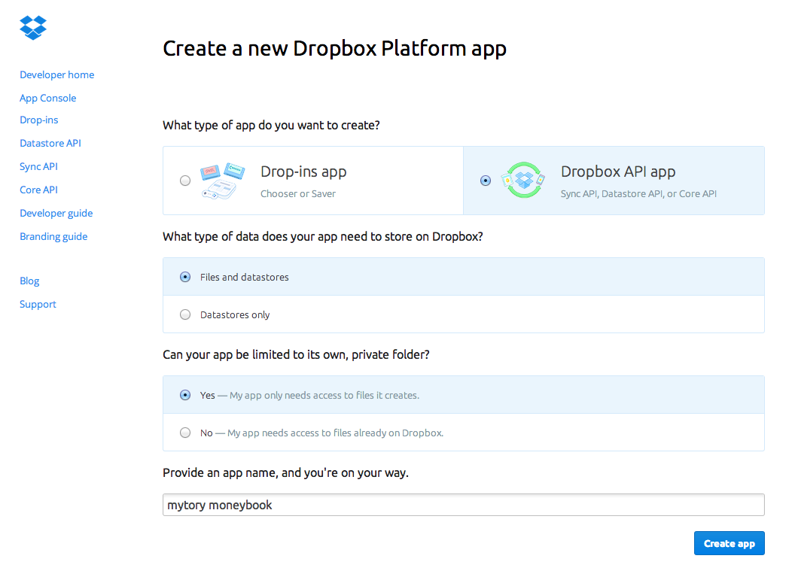

Mytory Moneybook
================

[English](readme.md)

소개
---------

Mytory Moneybook은 단순하고 강력한 웹앱입니다. 데스크탑과 스마트폰 브라우저에서 사용할 수 있습니다.

이 앱은 __데이터를 드롭박스에 저장합니다.__ 드롭박스를 연결한 뒤 사용하면 그만입니다.

사용법
---------

두 가지 방법으로 사용할 수 있습니다.

### 바로 사용하기 ###

가장 간단한 방법은 [Mytory Moneybook 서비스 페이지](https://dl.dropboxusercontent.com/u/15546257/moneybook/moneybook.html)에서 사용하는 것입니다. 서비스를 위한 웹사이트를 만든 건 아니고, 그냥 제 드롭박스 Public 폴더에 파일을 놔둔 것뿐입니다.

데이터는 사용자 자신의 드롭박스 계정에 저장되므로, 제 데이터 외에 어느 누구의 데이터도 볼 수 없습니다.

주의사항이 있습니다. 이 서비스는 개인용도로 사용하려고 만든 것이기 때문에, 저는 어떤 책임도 지지 않습니다. 다만, 상식에 맞는 도의적인 서비스는 할 것입니다.

### 설치해서 사용하는 방법 ###

자신의 드롭박스 Public 폴더에 설치해서 사용할 수도 있습니다. 2012년 12월 이후 가입자는 Public 폴더가 기본적으로 비활성화돼 있으니 [활성화](https://www.dropbox.com/enable_public_folder)해 주셔야 합니다.

파일을 [다운로드](http://dl.dropboxusercontent.com/u/15546257/moneybook/mytory-moneybook.zip)한 다음 Public 폴더 하위에 아무 폴더나 만들고 거기 다운로드한 파일 압축을 풀어서 다 넣습니다.

다음으로 [이 페이지](https://www.dropbox.com/developers/apps/create)에서 드롭박스 앱을 만듭니다. 아래 이미지를 참고하세요. 이름은 아무거나 넣으면 됩니다.

OAuth redirect URIs에는 Public 폴더에 있는 `moneybook.html`의 공개 링크(Public link)를 복사해서 넣습니다. Add 버튼을 꼭 눌러 줘야 합니다.

그 뒤 설정 페이지에 있는 App Key를 복사해서, `config.js` 파일에 있는 `app_key` 항목을 덮어 씁니다.

이후 `moneybook.html`의 공개 링크(Public link)로 접속하면 사용할 수 있습니다.

LICENSE
-------

Mytory Moneybook은 [GNU GENERAL PUBLIC LICENSE](http://www.gnu.org/licenses/gpl.html)입니다. 제 소스를 사용한 사람은 같은 라이센스 하에 소스를 공개해야 하죠. 

* GNU GENERAL PUBLIC LICENSE(GPL)에 대한 간략한 한글 설명은 다음을 참고하세요 : [위키백과 GPL](http://ko.wikipedia.org/wiki/GNU_%EC%9D%BC%EB%B0%98_%EA%B3%B5%EC%A4%91_%EC%82%AC%EC%9A%A9_%ED%97%88%EA%B0%80%EC%84%9C)
* [GPL 한글 번역 페이지](http://korea.gnu.org/people/chsong/copyleft/gpl.ko.html)(물론 영문판만 효력이 있습니다.)

사용한 라이브러리들의 라이센스는 다음과 같습니다.

* Bootstrap 3.1 : [MIT License](https://github.com/twbs/bootstrap/blob/master/LICENSE)
* js-xls : [Apache License, Version 2.0](http://www.apache.org/licenses/LICENSE-2.0)
* polyglot : [BSD License](http://airbnb.github.io/polyglot.js/polyglot.html)
* momentjs : [MIT License](https://github.com/moment/moment#license)
* jQuery : [MIT License](https://github.com/jquery/jquery/blob/master/MIT-LICENSE.txt)
* Underscore : [MIT License](http://documentcloud.github.io/underscore/docs/underscore.html)
* Backbone : [MIT License](http://backbonejs.org/docs/backbone.html)
* CSSLoad.net : [completely free to use](http://cssload.net/en/terms_of_use)