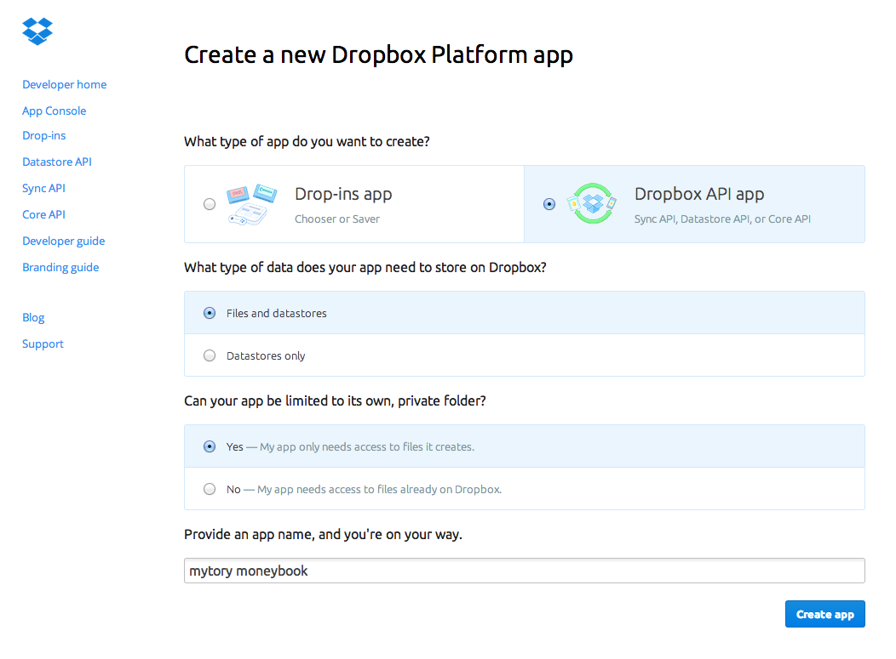
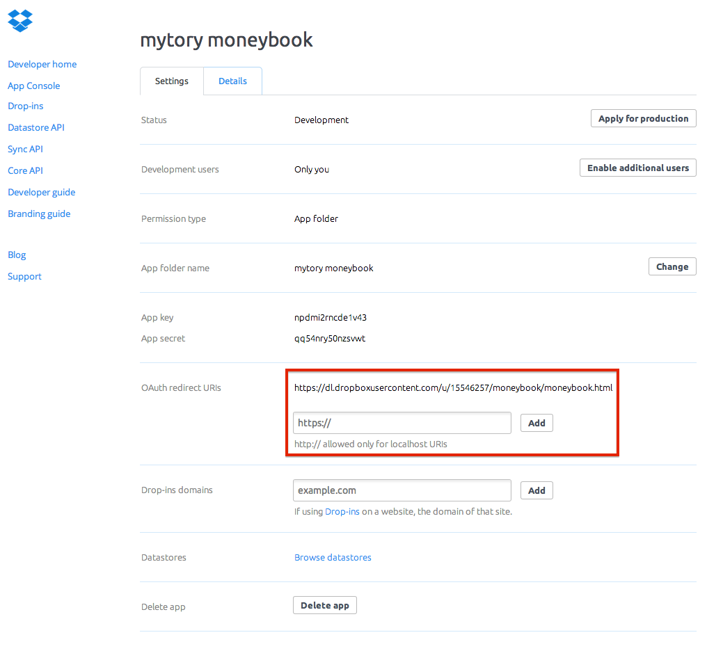

Mytory Moneybook
================

[Korean](readme.ko.md)

Introduce
---------

Mytory Moneybook is simple and powerful webapp. You can use this app on web browser on desktop or smartphone.

This app save data to dropbox. Set dropbox access, and use.

Get start
---------

You can use this app, by two way.

### Web Service

You can use this app on [mytory moneybook service page](https://dl.dropboxusercontent.com/u/15546257/moneybook/moneybook.html). This is just my Dropbox Public link. This link is for my own purpose. But you can use. 

I never see your data. Data will be saved to your dropbox datastore.

### Installation your Dropbox Public folder.

First, [Enable Dropbox Public folder](https://www.dropbox.com/enable_public_folder).

Second, create dropbox app on [this page](https://www.dropbox.com/developers/apps/create). See below. Enter app name you want.

And, You have to enter `moneybook.html` file's dropbox public link to OAuth redirect URIs field. And don't forget click Add button.

In setting page, copy App key. Next, go to Mytory Moneybook's `config.js`. Enter App key.

Connect to public link of `moneybook.html` using web browser. And use! Simple!

I recommend google chrome or mobile browser. This app only support modern browser.

LICENSE
-------

Mytory Moneybook is under [GNU GENERAL PUBLIC LICENSE](http://www.gnu.org/licenses/gpl.html).

Below is licenses of libraries.

* Bootstrap 3.1 : [MIT License](https://github.com/twbs/bootstrap/blob/master/LICENSE)
* js-xls : [Apache License, Version 2.0](http://www.apache.org/licenses/LICENSE-2.0)
* polyglot : [BSD License](http://airbnb.github.io/polyglot.js/polyglot.html)
* momentjs : [MIT License](https://github.com/moment/moment#license)
* jQuery : [MIT License](https://github.com/jquery/jquery/blob/master/MIT-LICENSE.txt)
* Underscore : [MIT License](http://documentcloud.github.io/underscore/docs/underscore.html)
* Backbone : [MIT License](http://backbonejs.org/docs/backbone.html)
* CSSLoad.net : [completely free to use](http://cssload.net/en/terms_of_use)